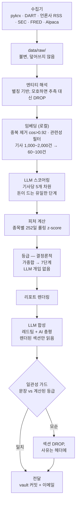

# market-briefing

**추적하는 모든 종목에 방향성 의견을 제시하고, 그 숫자가 나온 산수를 그대로 보여주고, 거기서 멈추는 한국·미국 주식 데일리 브리핑.**

이 시스템은 매매를 실행하지 않는다. 사람이 읽고 판단하는 문서를 만든다.

[](tests/)
[](pyproject.toml)
[](PREREGISTRATION.md)

English: **[README.md](README.md)**

<table>
<tr>
<td>

**먼저 읽을 것**
[짧은 버전](#짧은-버전) · [실제 출력](#실제-출력은-이렇게-생겼다) · [왜 이렇게 만들었나](#왜-이렇게-만들었나)

</td>
<td>

**동작 방식**
[파이프라인](#파이프라인-동작-방식) · [등급](#등급이-매겨지는-방식) · [AI 가드](#ai-총평이-정직함을-유지하는-방식)

</td>
<td>

**쓸 만한가**
[평가](#평가-그리고-실패한-측정은-어떻게-생겼나) · [진행 상황](#지금-어디까지-왔나) · [저장소 구조](#저장소-구조)

</td>
</tr>
</table>

---

## 짧은 버전

하루 두 번 GitHub Actions가 시장 데이터와 뉴스를 수집하고, 뉴스를 구조화된 숫자로 바꾸고, 피처를 계산해서 한국어 브리핑을 만든다. 결과물은 Obsidian vault와 이메일로 전달된다.

| 실행 | 시각 (KST) | 커버리지 |
|---|---|---|
| `RUN_MORNING` | 07:00 | 미국장 마감(전일) + 한국장 프리마켓 — KOSPI 개장 2시간 전 |
| `RUN_EVENING` | 21:30 | 한국장 마감(당일) + 미국장 프리마켓 — 미국장 개장 1시간 전 |

2026-08-03부터 무인으로 돌고 있다. [`reports/`](reports/)에 12개의 브리핑이 커밋돼 있고, 샘플이 아니라 실제 출력이다.

### 실제 출력은 이렇게 생겼다

모든 등급은 z-score 가중합이고, 브리핑은 그 요약이 아니라 **분해 결과**를 찍는다:

```
### 000660 SK하이닉스 — 약한 매도 (-0.47)

- 20일 섹터 상대강도  z=-1.83 → 기여 -0.274
- 기관 5일 순매수     z=-0.43 → 기여 -0.064
- 외국인 5일 순매수   z=-0.12 → 기여 -0.037
- 소계 -0.376 ÷ 근거 충족도 80% = -0.47
  - 부재: 공매도 잔고 비중, 3년 PBR 밴드 — 나머지 가중치로 재정규화됨
```

이 블록의 세 가지가 설계 전체의 논거다:

- **숫자가 재현된다.** 모델이 쓴 게 아니다. 같은 입력이면 언제나 같은 등급이 나온다.
- **없는 입력이 이름으로 적힌다.** 두 피처에 데이터가 없어서 가중치를 재정규화했고, 어느 것이 빠졌는지 독자에게 말한다. 0으로 채웠다면 점수가 관망 쪽으로 끌려가면서도 겉보기엔 온전한 정보처럼 보였을 것이다.
- **항목을 더하면 맞는다.** 독자가 검산할 수 있다. 맞지 않는 숫자는 사람에게 검산을 그만두라고 가르친다.

헤더도 실행 자체에 대해 같은 정직함을 지킨다:

```
ℹ 데이터 기준: KR 2026-08-12 · US 2026-08-11 · MACRO 2026-08-11
ℹ 등급 근거 충족도: 0.75/0.75 (100%)
⚠ 미구현 피처: news_polarity(0.20), rev_4w(0.15) — 설계 가중치 1.10의 32%
ℹ 엔티티 모호 비율: 7.7% (기사 1,153건)
```

누락된 데이터는 로그가 아니라 문서에 나타난다. 보고서가 아예 안 나오는 것보다 부분 보고서를 발행한다.

---

## 왜 이렇게 만들었나

저장소의 모든 결정을 다섯 가지 원칙이 결정한다.

**1. 의견은 계산되는 것이지 작성되는 것이 아니다.** 브리핑은 모든 종목에 강한 매수 ~ 강한 매도 등급을 매기지만, 그 등급은 산수다 — z-score 가중합. LLM은 개별 기사를 고정된 숫자 스키마로 바꾸기만 하고 등급은 보지도 않는다. 이게 의견을 재현 가능하게 만들고, 재현 가능성은 그 의견이 쓸 만했는지 나중에 확인할 수 있는 전제 조건이다.

**2. 결정론이 먼저다.** 문자열 매칭, 임베딩 유사도, 통계로 풀 수 있는 것은 그렇게 푼다. LLM 호출은 언어 이해가 진짜로 필요한 판단에만 쓴다. 비용 최적화가 아니라 설계 제약이다.

**3. 원본 데이터는 불변이다.** 수집된 데이터는 날짜 파티션에 쓰이고 절대 덮어쓰지 않는다. 3개월 뒤 이것이 백테스트 데이터셋이 된다. 뉴스는 놓친 시간을 복구할 수 없는 유일한 소스다 — RSS는 히스토리 없는 롤링 버퍼다. KRX 세션 중 시간당 두 번 수집하고 gitignore 대신 커밋하는 이유가 그것이다.

**4. 모델은 교체 가능하다.** 모든 모델 호출은 하나의 어댑터를 지난다. 벤더 SDK는 트리의 다른 어디에서도 import되지 않는다.

**5. 평가 기준은 데이터 수집 전에 동결됐다.** 2026-08-02자 [PREREGISTRATION.md](PREREGISTRATION.md). 이후 모든 개정은 날짜, 이유, 그리고 **그 시점에 데이터를 이미 봤는지 여부**와 함께 그 문서에 기록된다.

### 의도적으로 하지 않는 것

- **주문·체결·취소 API를 호출하지 않는다.** 읽기 전용 엔드포인트만. 브리핑은 의견을 주고, 사람이 결정하고 행동한다.
- LLM이 쓴 등급이나 근거는 없다 — 그것들은 산수이고, 산수이므로 감사 가능하다.
- 종목 별칭을 자동 생성하지 않는다. 잘못된 별칭은 하위 모든 숫자를 조용히 오염시키지만, 누락된 별칭은 커버리지만 잃는다.
- 3개월 평가 게이트를 통과하기 전에는 실제 자금을 넣지 않는다.

> [!IMPORTANT]
> **의견과 실행은 다른 것이고, 이 프로젝트는 둘 다 진지하게 받아들인다.** 근거를 붙여 강한 매수라고 말하는 것이 제품이다. 주문을 넣는 것은 제품이 아니고, 앞으로도 되지 않는다.

---

## 파이프라인 동작 방식



비싼 단계가 가장 마지막에, 가장 적은 항목에 대해 돈다. 중복 제거와 관련성 필터를 LLM에서 로컬 임베딩으로 옮긴 이유는 셋이다. 비용이 0이 되고, 임베딩은 `temperature=0`에서도 재현되지 않는 LLM과 달리 완전히 재현되며, 문장 단위 유사도가 한국 언론의 재보도를 LLM 판단보다 정확하게 잡는다.

### 등급이 매겨지는 방식

피처 z-score의 가중합에 뉴스 폴라리티 집계를 더해 7단계로 버킷팅한다. 가중치와 컷포인트는 [`config/rating.yaml`](config/rating.yaml)에 있다.

| 강한 매수 | 매수 | 약한 매수 | 관망 | 약한 매도 | 매도 | 강한 매도 |
|---|---|---|---|---|---|---|
| ≥ +2.0 | +1.0 | +0.4 | ±0.4 | −0.4 | −1.0 | ≤ −2.0 |

빈약한 근거 위에 얹힌 자신만만한 등급은 등급이 없는 것보다 나쁘므로, 가드가 둘 있다.

- 누락된 피처는 **제외하고 가중치를 재정규화**한다. 조용히 0으로 취급하지 않는다.
- 가중치 충족도가 50% 아래면 그 종목은 관망으로 강제하고 빠진 입력을 이름으로 적는다.

### AI 총평이 정직함을 유지하는 방식

⑧ 총평은 LLM이 방향에 대해 문장을 쓰는 유일한 자리다 — 이 프로젝트가 다른 모든 곳에서 모델에게 금지하는 바로 그것이다. 세 가지 성질이 그것이 등급이 되는 것을 막고, 셋 다 하중을 받는다.

- **렌더된 결정론적 섹션만 읽고 원문 기사는 절대 읽지 않는다.** 스코어링은 이미 상류에서 끝났고, 총평은 그걸 다시 할 수 없다.
- **발행 전에 검사된다.** [`src/report/consistency.py`](src/report/consistency.py)가 문장 속 모든 등급 레이블을 찾아 별칭 사전으로 종목에 귀속시키고 계산된 등급과 대조한다. 모순이면 섹션이 삭제되고 헤더가 그 사실을 말한다.
- **하류에서 아무도 읽지 않는다.** 어떤 피처도, 점수도, 섀도 포트폴리오도, 평가 지표도 읽지 않는다. 파이프라인의 잎이다.

가드는 두 번째 LLM이 아니라 문자열 매칭이다 — 판단을 검증하는 데 판단이 필요한 검사기는 아무것도 검사하지 않는다. 가드와 프롬프트는 한 쌍이다. 프롬프트가 일곱 개 등급 레이블을 등급 어휘로 예약하고 통상적인 시장 움직임은 순매수 / 수급 이탈로 쓰도록 요구하는데, 그 규칙이 없으면 매수는 한국어 시장 문장에 끊임없이 등장하고 섹션은 매일 삭제된다.

매처의 흥미로운 부분은 **무엇을 안 잡느냐**다. 순매수, 매수세, 매도호가는 등급 주장이 아니라 통상 시장 어휘이므로, 인접 한글 음절에 붙은 레이블은 기각된다 — 조사(매수는, 매수로)는 닫힌 집합이라 허용 목록으로 예외 처리하고, 복합명사는 그렇지 않다.

### 자기기만을 막는 두 가지 규칙

**룩어헤드 금지.** 시각 `t`에 계산되는 피처는 `t` 이후 타임스탬프의 데이터를 절대 쓰지 않는다. 피처를 계산하는 모든 함수는 명시적 `as_of` 인자를 받는다 — 경계 없이 "최신" 데이터를 읽는 함수는 편의가 아니라 버그다. 뉴스는 발행 시각으로 조인되고, 장중에 발행된 뉴스는 **다음** 세션 시가에야 거래 가능한 것으로 간주한다.

**정규화.** 모든 피처는 종목별 252 거래일 롤링 z-score다. 절대값을 종목 간에 비교하지 않는다.

<details>
<summary><b>브리핑에 담기는 내용 — 아홉 개 섹션 전부</b></summary>

1. **미국 → 한국 전이** — 브리핑에서 가장 방어 가능한 정량 콘텐츠이고, LLM이 전혀 개입하지 않는 섹션 중 하나다. 미국 섹터 ETF를 한국 섹터에 매핑하고 각각의 60일 롤링 상관을 함께 표시해서, 무너진 관계가 조용히 신뢰되지 않고 눈에 보이게 한다.
2. **보유·관심 종목 스캔** — 종목당 한 줄. 외국인 수급, 신규 공시, 실적 추정 변화, 밸류에이션 밴드, 뉴스 급증, 변동성으로 플래그.
3. **뉴스 점수 집계** — 2단계 점수의 종목별 롤업.
4. **캘린더** — 실적, FOMC/CPI, 옵션 만기, 배당락일.
5. **레드팀** — LLM에게 그날의 결론에 **반대만** 하도록 지시한다.
6. **방향성 등급** — 모든 종목을 7단계로, 근거와 함께.
7. **섀도 포트폴리오 손익** — 그 등급을 따랐을 가상 계좌가 어떻게 됐을지를 실제 계좌와 분리해 추적한다. 등급이 단순한 의견이 아니라 반증 가능한 것이 되는 지점이다.
8. **AI 총평** — 위 전부를 30초짜리 독자가 필요한 것으로 합성한 5~8줄. 레드팀과 함께 LLM이 쓰는 두 섹션 중 하나다.
9. **중기 레짐** — 금리 곡선, 달러, 원/달러, WTI, 미국 섹터 로테이션을 120일 구간으로. ①처럼 결정론적이다.

표시 순서는 ID 순서가 아니다. ⑧은 가장 먼저 렌더되지만(급한 독자가 바로 만나도록) 가장 나중에 생성된다(나머지 전부를 소비하므로). ID는 문서와 코드 전반에서 참조되는 안정적 식별자라, 섹션이 추가돼도 재번호를 매기지 않는다.

</details>

---

## 평가, 그리고 실패한 측정은 어떻게 생겼나

평가 기준은 데이터가 존재하기 전인 2026-08-02에 [PREREGISTRATION.md](PREREGISTRATION.md)에 동결됐다.

| 게이트 | 기준 | 미달 시 |
|---|---|---|
| **2주**<br>2026-08-12 → 08-26 | 파이프라인 무중단 · 데이터 정합성 오류 0 · `ambiguous` < 30% · 모델간 polarity 상관 > 0.5 | 시그널 작업 중단, 측정 계층 수리 |
| **3개월**<br>2026-08-13 → 11-13 | ICIR > 0.3 · 섀도 포트폴리오가 KODEX 200 매수후보유를 이김 | 시그널 로직 폐기, 재설계 |
| **6개월** | 위 결과가 수수료·거래세·슬리피지 차감 후에도 유지 | 프로젝트 종료, 인덱스로 전환 |

**2주로는 시그널이 작동하는지 측정할 수 없다.** 적중률 55%를 50%와 구분하려면 독립 관측이 약 800개 필요한데, 30종목 2주는 시장 베타가 횡단면 독립성을 잡아먹고 나면 유효 60~100개다. 그래서 초기 게이트는 예측 정확도가 아니라 **측정 안정성** — 서로 다른 세 모델이 같은 기사를 채점했을 때 서로 일치하는지 — 을 잰다. 일치하지 않는다면 점수는 모델별 노이즈이고 검증할 가치가 있는 것이 아직 없다는 뜻이다.

### 읽을 가치가 있는 부분

모델 품질은 다섯 차원으로 손수 라벨링한 기사 100건의 골든셋을 상대로 채점한다. 그 기준은 자기 자신과 일치하는 만큼만 예리하므로, 100건 중 10건을 주기적으로 **답을 가린 채** 다시 라벨링하고 두 회차의 차이를 **노이즈 바닥값**으로 삼는다. 두 모델의 차이가 바닥값보다 작으면 그것은 증거가 아니다.

2026-08-13에 그 검사가 **실패했다.** 집계 불일치가 임계 0.25에 대해 0.30으로 나왔고, 한 차원(`forwardness`)이 그 전부를 만들었다 — 그 차원을 빼면 같은 통계가 0.195, 통과다.

0.195는 **어느 차원이 불일치를 지고 있는지에 대한 진단으로** 기록됐고, 세트를 대신 채점할 대안 집계로는 **명시적으로 기록되지 않았다.** 결과를 본 뒤 통과하는 통계를 고르는 것은 사전등록 문서가 존재하는 바로 그 이유이므로, 실패는 실패로 남았고 임계값은 손대지 않았으며 결과는 처음 보이는 것보다 좁다. `forwardness`로는 모델 순위를 아예 매길 수 없고, 두 후보 모델 사이에서 이전에 인용됐던 근거 하나가 철회됐다.

모델 선택에 무슨 비용을 치렀는지를 포함한 전문은 [PREREGISTRATION §R](PREREGISTRATION.md)의 2026-08-13 항목에 있다. 그 문서의 여러 항목은 **자기에게 불리한 정정**이다. 그게 이 문서의 요점이다.

<details>
<summary><b>"무중단"과 "오류 0"이 정확히 무슨 뜻인가</b></summary>

**"무중단"은 구체적인 뜻이 있고, 적혀 있다.** 발사된 모든 실행이 실행 파일을 남길 것, 설명되지 않은 `check_feed_continuity` 실패가 없을 것, 같은 원인으로 연속 두 실행이 검증에 실패하지 않을 것 — [§8.5](PREREGISTRATION.md)가 전문을 정의하고 알려진 사건들에 대해 캘리브레이션한다. 가운데 조건은 2026-08-11에 측정 가능해졌다. 응답하지 않는 피드는 이제 응답하는 다음 실행이 판정하므로, 기준은 파이프라인이 고칠 수 있는 원인을 세지 그것이 놓인 날씨를 세지 않는다. 전달된 실행 비율은 결정과 함께 보고되지만 기준은 아니다 — 실행을 떨어뜨리는 것은 이 파이프라인이 아니라 GitHub 스케줄러다.

**"데이터 정합성 오류 0"은 부재가 아니라 모순을 뜻한다.** 네 개의 검사가 센다 — `schema`, `structural_invariants`, `flow_identity`, 그리고 Alpaca 대 Tiingo 종가 비교 — 커밋된 리포트 헤더에서 읽는다. `missing_ratio`와 `trading_day_continuity`는 [§8.5](PREREGISTRATION.md)에 이유를 적고 제외했고, 두 번째는 Tiingo 레이트리밋 한 번에서 25건이 터진 적이 있기 때문이다. 목록은 개수가 알려지기 전에 작성됐고, 지금까지의 기록에서 0이다.

**스케줄은 최선 노력이고, 그것은 가정이 아니라 측정된 값이다.** GitHub은 선언된 실행의 대략 3분의 1을 발사한다. 2026-08-03~07 동안 뉴스 워크플로가 하루 31회를 선언하고 6~10회를 전달해 시간당 커버리지 42.6%였다. 하류 전부가 그걸 견디도록 만들어져 있다 — `last_closed_session()`은 날짜가 아니라 시계로 실행을 해석하고, `check_feed_continuity`는 공백이 실제로 무엇을 잃었는지 추측 대신 측정한다. `etnews_economy`를 뺀 뒤 관측된 공백 45건 중 1건(2.2%)만 남은 피드 중 가장 빠른 버퍼를 넘겼으므로, 커버리지 숫자는 놀랍지만 실현된 손실은 그렇지 않다.

</details>

---

## 저장소 구조

```
market-briefing/
├── SPEC.md                    전체 설계 명세 — 최종 권위 문서
├── PREREGISTRATION.md         데이터 수집 전에 동결된 평가 기준
├── MANUAL-TASKS.md            사람만 할 수 있는 일 (키, 워치리스트, 골든셋)
├── API-KEYS.md                자격증명별 발급 절차
├── CLAUDE.md                  이 저장소에서 일하는 AI 에이전트의 규칙
│
├── config/                    손으로 관리하는 모든 결정이 여기 있다
│   ├── watchlist.yaml         KR 31 + US 40 종목
│   ├── aliases.yaml           종목 별칭 사전 — 자동 생성 금지
│   ├── rating.yaml            등급 가중치와 컷포인트
│   ├── news_feeds.yaml        RSS 소스 — 커버리지는 이 파일과 같다
│   ├── sector_mapping.yaml    미국 ETF ↔ 한국 섹터
│   ├── models.yaml            단계별 모델, 베이크오프 근거 주석 포함
│   └── delivery.yaml          출력 채널 — 채널을 선언할 수 있는 유일한 곳
│
├── src/
│   ├── util/session.py        UTC/KST, 거래일, 룩어헤드 경계
│   ├── util/config.py         설정 로딩 + 손편집 안전장치
│   ├── collectors/            validate.py + 수집기 6개
│   ├── entity/resolve.py      별칭 기반 종목 매칭 + 모호 버킷
│   ├── embed/                 중복 제거 + 관련성 — SPEC §12 6단계, 미착수
│   ├── features/              compute.py (7개 중 5개) + normalize.py (z-score)
│   ├── llm/                   adapter.py (벤더 중립), score.py, prompts/
│   ├── report/                rating.py · consistency.py · render.py
│   ├── notify/                vault + email 어댑터
│   └── eval/                  bakeoff.py · ic.py · shadow_portfolio.py
│
├── scripts/                   config_helper · backfill · collect_daily · golden
├── reports/                   렌더된 브리핑, 매일 커밋
├── tests/                     오프라인 672, 네트워크 10
└── data/                      raw/ · ratings/ · bakeoff/ · golden/ 커밋 — 각각의 이유는 .gitignore에
```

<details>
<summary><b>완성된 모듈이 실제로 하는 일</b></summary>

**`src/util/session.py`** — 모든 것은 UTC로 저장하고 KST로 표시한다. 장 세션은 하드코딩된 휴장일 목록이 아니라 `pandas_market_calendars`에서 온다. 한국 음력 명절이 매년 움직이기 때문이다. 라이브러리가 여전히 개장일로 보고하는 2026년 KRX 휴장 두 건(지방선거일, 제헌절)에 대해 **삭제 전용** 보정을 들고 있는데, KRX 자체와 대조해서 찾았고 네트워크 테스트가 목록을 재유도하므로 썩는 대신 실패한다. 미국 종가는 **유도**되므로 서머타임 중에는 05:00 KST, 그 외에는 06:00 KST에 정확히 떨어진다 — 두 숫자 어느 것도 코드에 나타나지 않는다.

**`src/collectors/validate.py`** — 모든 수집기는 fetching 로직보다 **먼저** 작성된 네 가지 검사를 통과해야 한다. 스키마(컬럼명과 dtype), 선언된 임계값 대비 결측률, 휴장일을 제외한 거래일 연속성, 그리고 하드코딩된 알려진 값 최소 하나. 결과는 raise만 하는 게 아니라 **보고**된다 — 실패한 수집기는 실패를 기록하고 파이프라인을 계속 진행시키므로, 헤더에 공백이 이름으로 적힌 부분 보고서가 발행된다.

**`src/report/rating.py`** — 피처 z-score를 7단계 방향성 등급과 그것을 만든 분해로 바꾼다. 순수 산수이고 완전히 재현 가능하다.

**`scripts/config_helper.py`** — 손으로 쓰는 두 설정 파일을 위한 운영 도구. `find`는 회사명을 종목코드와 KRX 섹터로 해석하고, `scaffold`는 별칭 항목의 기계적인 절반을 gitignore된 워크시트에 채워 넣고, `audit`은 이미 수집된 뉴스에 대해 `aliases.yaml`을 채점한다. `config/aliases.yaml`을 절대 쓰지 않고 `aliases` 값을 절대 제안하지 않는다 — 커버리지를 잃을 수는 있어도 오귀속시킬 수는 없는 `exclude`와 `ambiguous_parents`만 제안한다.

**`src/util/config.py`** — 로딩이 곧 검증이다. 손으로 만들기 쉽고 나중에 발견하기 불가능한 실수들을 거부한다. 두 종목이 주장하는 별칭, 자기 exclude 목록에도 있는 별칭, 따옴표 없는 종목코드, 순서가 뒤집힌 등급 컷포인트.

> [!WARNING]
> **따옴표 없는 종목코드 함정.** YAML은 앞자리가 0인 맨 숫자를 8진수로 읽으므로, 따옴표 없는 `000660`(SK하이닉스)은 조용히 정수 `432`가 된다. `005930`이 살아남는 건 `9`가 유효한 8진 숫자가 아니기 때문인데, 그래서 이 실패는 일관성이 없고 놓치기 매우 쉽다. 종목코드는 항상 따옴표로 감싼다. 로더가 따옴표 없는 것을 설명과 함께 거부한다.

</details>

---

## 시작하기

```bash
uv sync                          # 의존성 설치
uv run pytest -m "not network"   # 기본 테스트 실행 — 672개
uv run ruff check . && uv run ruff format .

cp .env.example .env             # 자격증명 입력 (API-KEYS.md 참조)
```

네트워크를 타는 테스트는 `@pytest.mark.network`로 표시돼 기본 실행에서 제외된다. import는 저장소 루트에서 해석된다 — `from src.util.session import ...` — `pythonpath = ["."]`를 통해서이고, [SPEC §10](SPEC.md)의 평평한 `src/` 레이아웃을 따른다. 이건 CI가 돌리는 애플리케이션이지 pip 설치되는 패키지가 아니기 때문이다.

**끝까지 돌리려면 이 저장소에 없는 자격증명이 필요하다.** [API-KEYS.md](API-KEYS.md)가 각각의 발급 절차를 안내한다. `tests/`의 모든 것은 커밋된 픽스처로 자격증명 없이 돈다.

---

## 지금 어디까지 왔나

**가동 단계.** 결정론적 파이프라인이 수집·해석·계산·등급·렌더·전달을 하루 두 번 무인으로 수행하고 있고, 2026-08-03부터 그래 왔다. `data/raw/`에 3년치 백필과 라이브 뉴스 기록이 있다. 골든셋과 모델 베이크오프는 끝났다. 빠진 것은 임베딩 파이프라인이고, 그게 없으면 `news_polarity`가 채점할 대상이 없다.

진행은 [SPEC §12](SPEC.md)의 13단계에 대해 추적하므로, 신뢰가 아니라 저장소에 대조해서 확인할 수 있다.

| 단계 | | 상태 |
|---|---|---|
| 1 | 저장소 + SPEC / PREREGISTRATION / CLAUDE | ✅ |
| 2 | `watchlist.yaml` + `aliases.yaml` | ✅ KR 31 + US 40 종목, 별칭 31개 |
| 3 | 수집기 + 검증 테스트 | ✅ 수집기 6개, 오프라인 672 / 네트워크 10 |
| 4 | `data/raw/`로 3년 백필 | ✅ macro · us_price · kr_price · kr_flow, 2023-08-03 → 2026-08-07 |
| 5 | 엔티티 해석 + 모호 비율 | ✅ 기사 2,432건 중 모호 8.8% (임계 30%) |
| 6 | 임베딩 파이프라인 (중복 제거 + 관련성) | ⬜ 미착수 — [notes/step6-plan.md](notes/step6-plan.md). 아무것도 막지 않음 |
| 7 | 골든셋 — 손수 라벨링한 기사 100건 | ✅ 완료. `relevance`는 정의 변경 후 2026-08-12에 전량 재라벨링 |
| 8 | 모델 어댑터 + 베이크오프 | ✅ 2026-08-13 완료 — `gpt-5.4` 선택 |
| 9 | 피처 계산 | ✅ 등급 피처 7개 중 5개, 가중치 1.10 중 0.75 |
| 10 | 리포트 렌더러 + 전달 | ✅ vault + 이메일 가동, 브리핑 12건 렌더 |
| 11 | 일일 수집 + 리포트 워크플로 | ✅ 2026-08-06 클라우드 왕복 완주 |
| 12 | 스케줄 번인 | 🟡 진행 중 — cron이 무인으로 발사 중 |
| 13 | 2주 게이트 | ⬜ 2026-08-12 시계 시작, 2026-08-26 판독 |

<details>
<summary><b>상세: 백필, 보류된 결정, 진행을 막는 것</b></summary>

### 백필이 들어왔고 z-score가 실제로 나온다

`kr_flow`가 2026-08-06에 끝났다. **22,528행, 31종목, 728세션**, 2023-08-03 ~ 2026-08-03, 결측 없음. 수급 항등식 — 외국인 + 기관 + 개인 + 기타법인 순매수의 합이 0, 구성상 참이며 투자자 컬럼 오매핑을 잡는 가장 싼 탐지기 — 이 **22,528행 전부에서** 성립한다.

히스토리가 들어오면서 피처가 `NaN`이기를 멈췄다. 아래는 같은 날 측정한 개수이고, 이후 KRX 하루마다 종목당 1세션씩 늘어난다:

| 피처 | 원본 | z-score |
|---|---:|---:|
| `foreign_flow_5d` | 22,383 | 14,067 |
| `inst_flow_5d` | 22,383 | 14,067 |
| `short_ratio` | 22,528 | 14,408 |
| `rel_strength_20d` | 18,368 | 11,816 |
| `valuation_band` | 0 | 0 |

> [!NOTE]
> `short_ratio`의 개수는 2026-08-13 공시 지연 수정 이전 값이고 측정된 그대로 뒀다. 이 피처는 이제 각 세션에 **기록된** 잔고가 아니라 **공시된** 잔고를 담고, 그 대가로 종목별 히스토리의 첫 세 세션을 잃는다 — 아카이브 전체에서 31행.

`valuation_band`가 비어 있는 이유는 756세션이 필요한데 창이 아직 그에 못 미치기 때문이다. 454910이 다른 모든 종목보다 정확히 **40세션** 뒤처진 것은 2023-10-05에 상장했기 때문이고, 이는 누락된 히스토리가 아니라 존재하지 않는 히스토리다.

`scripts/backfill.py`는 재개 가능하게 유지된다. KRX는 주소 단위로 스로틀링하고 — 대략 250요청이면 몇 시간짜리 HTML 에러 페이지를 얻는다 — `kr_flow`는 히스토리 1년당 124요청이 들므로, 재실행은 여러 창에 걸쳐 떨어진다.

### 보류된 결정 두 가지

**`rev_4w`에 데이터 소스가 없다.** [SPEC §5](SPEC.md)가 이를 **컨센서스** EPS의 4주 변화 — 즉 포워드 애널리스트 추정 — 로 정의한다. pykrx의 `EPS`는 후행이고, 그것으로 대체하면 피처처럼 보이지만 피처가 아닌 숫자가 나온다. 제대로 하려면 추정치 벤더(FnGuide, QuantiWise)가 필요하다. 가중치 0.15이고, 없으면 `rate()`가 재정규화한다.

**`valuation_band`는 스스로 켜지고, 4년 백필은 시간만 앞당긴다.** 756세션 PBR 백분위인데, 저장된 창이 2026-08-07 기준 732세션이고 KRX 세션마다 1씩 늘어나므로 백필이 전혀 없어도 30종목은 **2026-09-11**에 756을 넘는다. 백필을 1년 늘리면 약 4주 앞당겨지고 KRX 요청 124회가 든다. 가중치 0.05 — 기다리는 게 명백한 기본값인 이유다.

### 왜 9단계를, 그리고 10단계까지 6~8단계보다 먼저 하나

`news_polarity`(0.20)는 LLM이 필요한 유일한 등급 피처다. 9단계에서 만든 다섯 개가 총 1.10 중 0.75를 지고 있어 `min_weight_coverage: 0.5`를 넘으므로, 임베딩 파이프라인·골든셋·베이크오프 없이도 진짜 결정론적 등급에 도달할 수 있다. 순서를 뒤집은 이유가 그것이다.

[2026-08-06 리뷰](notes/review-2026-08-06.md)가 같은 논리를 10단계까지 확장했다. PREREGISTRATION은 2주 검증을 **10~12단계가 필요한** 항목(파이프라인 무결성, 데이터 정합성, 엔티티 정확도, 브리핑이 실제로 읽히는지)과 6~8단계가 필요한 항목으로 나눈다. LLM 단계를 먼저 만들면 그 시계가 시작되지 않는다.

### 진행을 막는 것

미결 항목은 [MANUAL-TASKS.md](MANUAL-TASKS.md)에 무엇을 막는지 순서로 추적된다. 2026-08-13 기준:

| # | 할 일 | 막는 것 |
|---|---|---|
| 1 | `BRIEFING_EMAIL_TO`를 `.env`와 Actions secret에 등록 | 이메일 전달 — 저장소 공개 전환으로 새로 생긴 항목 |
| 2 | 1회성 ~$4.44 게이트 측정 비용 승인 | PREREGISTRATION §8.5 2주 게이트의 4번 기준 — [notes/gate-inter-model-plan.md](notes/gate-inter-model-plan.md) |
| 3 | `rev_4w` 데이터 소스 결정 | `news_polarity` 외에 소스가 없는 유일한 등급 피처 |
| 4 | `config/rating.yaml` 캘리브레이션 | 신뢰할 수 있는 등급 — 2주 게이트 **이후에** 할 것 |
| 5 | KIS 신청 | 실시간 시세만. 오늘 아무것도 막지 않음 |

**6단계를 막는 것은 더 이상 없고, 6단계도 더 이상 아무것도 막지 않는다** — `src/entity/resolve.py`만으로도 이미 하루 92~148개의 (기사, 종목) 쌍이 나오고, 이는 SPEC §6.1이 스스로 정한 60~100 목표 구간 안이다.

### 2026-08-07 리뷰에서 나온 결함

[notes/review-2026-08-07.md](notes/review-2026-08-07.md)에 추적되며, 노트를 열지 않고도 상태가 보이도록 여기 적어 둔다.

| | 결함 | 상태 |
|---|---|---|
| H1 | 등급 아카이브 | ✅ 2026-08-08 수정 |
| H2 | 유령 가중치 | ✅ 2026-08-08 수정 |
| M1 | 뉴스 실패 보고 | 🟡 부분 해결 — 독립 뉴스 실행에서 검사가 실패하면 비정상 종료하므로 GitHub이 실패를 메일로 보낸다. 상세는 여전히 실행 페이지를 열어야 한다 |
| L1 | — | ⬜ 미해결, 비용 없음 |

</details>

---

## 문서

| 파일 | 목적 |
|---|---|
| [SPEC.md](SPEC.md) | 전체 설계 명세. 최종 권위 문서. |
| [PREREGISTRATION.md](PREREGISTRATION.md) | 수집 전에 동결된 평가 기준과 개정 로그. |
| [MANUAL-TASKS.md](MANUAL-TASKS.md) | 사람만 할 수 있는 일. 막는 순서대로. 의도적으로 한국어. |
| [RESEARCH.md](RESEARCH.md) | 공개된 LLM 트레이딩 에이전트 조사 — 무엇을 주장하고, 무엇이 검증을 견디고, 무엇이 여기 적용되나. |
| [API-KEYS.md](API-KEYS.md) | 자격증명별 가입 절차와 제공자별 함정. |
| [CLAUDE.md](CLAUDE.md) | 이 저장소에서 일하는 AI 에이전트의 운영 규칙. |

---

## 이 저장소의 데이터에 관하여

`data/raw/kr/news/`는 RSS 기록 — 제목, 발행사가 제공한 요약, 언론사, 링크, 시각 — 을 출처와 함께 보관한다. 피드가 히스토리 없는 롤링 버퍼이고 수집하지 못한 한 시간은 백테스트 데이터셋에서 영구히 사라지기 때문이다. 발행사가 신디케이트하는 범위를 넘어 긁어온 것은 없다. `data/golden/`은 그중 100건에 대한 한 사람의 손 라벨링이고, 이 저장소에서 어떤 값을 치러도 재생성할 수 없는 유일한 산출물이다.

## 라이선스

라이선스를 부여하지 않는다. 이 코드는 읽히기 위해 공개됐지 재사용을 위해 공개된 것이 아니다.
