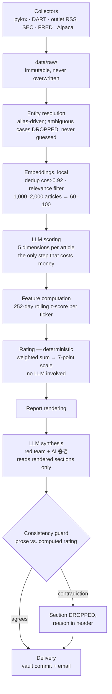

# market-briefing

**A daily Korean/US equity briefing that states a directional opinion on every ticker it tracks, shows the arithmetic behind it — and then stops.**

This system does not execute trades. It produces a document a human reads and acts on.

[](tests/)
[](pyproject.toml)
[](PREREGISTRATION.md)

한국어: **[README.ko.md](README.ko.md)**

<table>
<tr>
<td>

**Read this first**
[The short version](#the-short-version) · [What the output looks like](#what-the-output-actually-looks-like) · [Why it is built this way](#why-it-is-built-this-way)

</td>
<td>

**How it works**
[Pipeline](#how-the-pipeline-works) · [Rating](#how-the-rating-works) · [The AI guard](#how-the-ai-commentary-stays-honest)

</td>
<td>

**Is it any good?**
[Evaluation](#evaluation-and-what-a-failed-measurement-looks-like) · [Project status](#project-status) · [Repo map](#repository-map)

</td>
</tr>
</table>

---

## The short version

Twice a day, a GitHub Actions run collects market data and news, turns the news into structured numbers, computes features, and renders a Korean-language briefing that lands in an Obsidian vault and an inbox.

| Run | Time (KST) | Covers |
|---|---|---|
| `RUN_MORNING` | 07:00 | US close (previous day) + KR pre-market — 2h before KOSPI opens |
| `RUN_EVENING` | 21:30 | KR close (same day) + US pre-market — 1h before US opens |

It has run unattended since 2026-08-03. Twelve briefings are committed in [`reports/`](reports/) — those are real output, not samples.

### What the output actually looks like

Every rating is a weighted sum of z-scores, and the briefing prints the decomposition rather than a summary of it:

```
### 000660 SK하이닉스 — 약한 매도 (-0.47)

- 20일 섹터 상대강도  z=-1.83 → 기여 -0.274
- 기관 5일 순매수     z=-0.43 → 기여 -0.064
- 외국인 5일 순매수   z=-0.12 → 기여 -0.037
- 소계 -0.376 ÷ 근거 충족도 80% = -0.47
  - 부재: 공매도 잔고 비중, 3년 PBR 밴드 — 나머지 가중치로 재정규화됨
```

Three things in that block are the whole design argument:

- **The number is reproducible.** No model wrote it. The same inputs give the same rating, forever.
- **The missing inputs are named.** Two features had no data, so the weights were renormalized and the reader is told which. Zero-filling would have dragged the score toward 관망 while still looking fully informed.
- **The terms reconcile.** A reader can add them up. A number that does not reconcile teaches people to stop checking.

The header carries the same honesty about the run itself:

```
ℹ 데이터 기준: KR 2026-08-12 · US 2026-08-11 · MACRO 2026-08-11
ℹ 등급 근거 충족도: 0.75/0.75 (100%)
⚠ 미구현 피처: news_polarity(0.20), rev_4w(0.15) — 설계 가중치 1.10의 32%
ℹ 엔티티 모호 비율: 7.7% (기사 1,153건)
```

Missing data appears in the document, not only in the logs. A partial report is published rather than no report.

---

## Why it is built this way

Five rules shape every decision in the repository.

**1. Opinions are computed, not written.** The briefing rates every ticker 강한 매수 through 강한 매도, but that rating is arithmetic — a weighted sum of z-scores. The LLM only converts individual articles into a fixed numeric schema; it never sees the rating. This is what makes the opinion reproducible, and reproducibility is the precondition for ever finding out whether it was any good.

**2. Determinism first.** Anything solvable with string matching, embedding similarity, or statistics is solved that way. LLM calls are reserved for judgments that genuinely need language understanding. This is a design constraint, not a cost optimization.

**3. Raw data is immutable.** Collected data is written to date-partitioned storage and never overwritten. In three months it becomes the backtest dataset. News is the one source where a missed hour is unrecoverable — RSS holds a rolling buffer with no history — which is why it is collected twice hourly through the KRX session and committed rather than gitignored.

**4. Models are swappable.** All model calls go through one adapter. No vendor SDK is imported anywhere else in the tree.

**5. Evaluation criteria were frozen before any data was collected.** See [PREREGISTRATION.md](PREREGISTRATION.md), dated 2026-08-02. Every revision since is logged there with its date, its reason, and whether data had already been seen at the time.

### What it deliberately does not do

- **No order, execution, or cancellation API calls.** Read-only endpoints only. The briefing gives an opinion; a human decides and acts.
- No LLM-authored ratings or rationale — those are arithmetic, and auditable as such.
- No auto-generated ticker aliases. A wrong alias corrupts every downstream number silently; a missing one only loses coverage.
- No real-money trading before the 3-month evaluation gate passes.

> [!IMPORTANT]
> **Opinion vs. execution.** These are different things and the project takes both seriously. Stating 강한 매수 with cited evidence is the product. Placing the order is not, and never becomes so.

---

## How the pipeline works



The expensive step runs last and on the fewest items. Deduplication and relevance filtering were moved out of the LLM and into local embeddings for three reasons: cost drops to zero, embeddings are reproducible where an LLM is not even at `temperature=0`, and sentence-level similarity catches Korean media re-reporting more accurately than an LLM judgment does.

### How the rating works

A weighted sum of feature z-scores plus aggregated news polarity, bucketed onto seven levels. Weights and cut points live in [`config/rating.yaml`](config/rating.yaml).

| 강한 매수 | 매수 | 약한 매수 | 관망 | 약한 매도 | 매도 | 강한 매도 |
|---|---|---|---|---|---|---|
| ≥ +2.0 | +1.0 | +0.4 | ±0.4 | −0.4 | −1.0 | ≤ −2.0 |

Two guards, because a confident-looking rating on thin evidence is worse than no rating:

- A missing feature is **excluded and the weights renormalized**, never silently treated as zero.
- Below 50% weight coverage the ticker is forced to 관망 and the missing inputs are named.

### How the AI commentary stays honest

Section ⑧ (AI 총평) is the only place an LLM writes prose about direction — the exact thing this project otherwise refuses to let a model do. Three properties keep it from becoming the rating, and all three are load-bearing:

- **It reads the rendered deterministic sections, never raw articles.** Scoring already happened upstream; the commentary cannot redo it.
- **It is checked before publication.** [`src/report/consistency.py`](src/report/consistency.py) finds every rating label in the prose, attributes it to a ticker through the alias dictionary, and compares it against the computed rating. Contradiction → the section is dropped and the header says so.
- **Nothing downstream reads it.** No feature, no score, no shadow portfolio, no evaluation metric. It is a leaf of the pipeline.

The guard is string matching, not a second LLM — a checker that needed judgment to verify a judgment would be checking nothing. It and the prompt are a matched pair: the prompt reserves the seven rating labels as rating vocabulary and requires ordinary market movement be written as 순매수 / 수급 이탈. Without that rule 매수 appears in normal Korean market prose constantly and the section would be dropped daily.

The interesting part of the matcher is what it *doesn't* match: 순매수, 매수세, 매도호가 are ordinary market vocabulary, not rating claims, so a label glued to an adjacent Hangul syllable is rejected — with an allowlist for trailing particles (매수는, 매수로), which are a closed class where compound nouns are not.

### Two rules that prevent self-deception

**Look-ahead prohibition.** A feature computed at time `t` never uses data timestamped at or after `t`. Any function computing features takes an explicit `as_of` parameter — a function that reads "the latest" data without a boundary is a bug, not a convenience. News is joined on publication timestamp, and news published during a session is assumed tradeable only at the *next* session's open.

**Normalization.** Every feature is a 252-trading-day rolling z-score per ticker. Raw absolute values are never compared across tickers.

<details>
<summary><b>What the briefing contains — all nine sections</b></summary>

1. **US → KR transmission** — the most defensible quantitative content in the briefing, and one of the sections with no LLM involvement at all. US sector ETFs mapped to Korean sectors, each shown with its trailing 60-day rolling correlation so a broken-down relationship is visible rather than silently trusted.
2. **Holdings & watchlist scan** — one line per ticker, flagged on foreign-investor flow, new filings, earnings revisions, valuation band, news spikes, volatility.
3. **News score aggregation** — per-ticker rollup of the Stage 2 scores.
4. **Calendar** — earnings, FOMC/CPI, options expiry, ex-dividend dates.
5. **Red team** — the LLM is instructed to argue *only* against the day's conclusions.
6. **Directional rating** — every ticker on a seven-point scale, with its evidence.
7. **Shadow portfolio P&L** — what a hypothetical account following those ratings would have done, tracked separately from any real account. This is what makes the ratings falsifiable rather than merely opinionated.
8. **AI 총평** — five to eight lines synthesizing all of the above into what a reader with thirty seconds needs. LLM-authored, and the only such section besides the red team.
9. **Medium-term regime** — yield curve, dollar, USD/KRW, WTI, and US sector rotation over 120 days. Deterministic, like ①.

Display order is not ID order: ⑧ renders first (so a rushed reader hits it immediately) but is generated last (it consumes everything else). The IDs are stable identifiers referenced across the docs and code, so they are never renumbered when a section is added.

</details>

---

## Evaluation, and what a failed measurement looks like

Criteria were frozen in [PREREGISTRATION.md](PREREGISTRATION.md) on 2026-08-02, before any data existed.

| Gate | Criteria | If not met |
|---|---|---|
| **2 weeks**<br>2026-08-12 → 08-26 | Pipeline uninterrupted · zero data-consistency errors · `ambiguous` < 30% · inter-model polarity correlation > 0.5 | Halt signal work, repair the measurement layer |
| **3 months**<br>2026-08-13 → 11-13 | ICIR > 0.3 · shadow portfolio beats KODEX 200 buy-and-hold | Discard the signal logic, redesign |
| **6 months** | The above holds after fees, transaction tax, and slippage | End the project, switch to indexing |

**Two weeks cannot measure whether the signal works.** Separating a 55% hit rate from 50% needs roughly 800 independent observations; two weeks of 30 tickers yields an effective 60–100 once market beta eats the cross-sectional independence. So the early gate measures *measurement stability* — whether three different models scoring the same articles agree with each other — rather than predictive accuracy. If they disagree, the scores are model-specific noise and there is nothing worth validating yet.

### The part worth reading

Model quality is scored against a golden set of 100 articles hand-labelled across five dimensions. That standard is only as sharp as its own self-consistency, so 10 of the 100 are periodically re-labelled blind and the gap between the two passes becomes a **noise floor**: a difference between two models smaller than the floor is not evidence.

On 2026-08-13 that check **failed**. The aggregate disagreement came in at 0.30 against a 0.25 threshold, and one dimension (`forwardness`) caused all of it — excluding it, the same statistic reads 0.195, a pass.

The 0.195 is recorded as a diagnosis of which dimension carries the disagreement, and explicitly **not** as an alternative aggregate to score the set against. Choosing the statistic after seeing which one passes is the exact failure mode a pre-registration exists to prevent, so the failure stands as a failure, the threshold was not touched, and the consequence is narrower than it first looks: `forwardness` may not be used to rank models at all, and one previously-cited margin between two candidate models was withdrawn as evidence.

The full entry, including what it cost the model selection, is in [PREREGISTRATION §R](PREREGISTRATION.md) under 2026-08-13. Several entries there are corrections against interest. That is the point of the document.

<details>
<summary><b>What "uninterrupted" and "zero errors" mean, precisely</b></summary>

**"Uninterrupted" means something specific, and it is written down.** Every run that fires records a run file, no unexplained `check_feed_continuity` failure, no two consecutive runs failing validation for the same cause — [§8.5](PREREGISTRATION.md) defines it in full and calibrates it against known incidents. The middle condition became measurable on 2026-08-11: a feed that does not answer is now judged by the next run that does, so the criterion counts causes the pipeline can fix rather than the weather it runs in. Delivered-run coverage is reported alongside the decision but is not a criterion: GitHub's scheduler drops the runs, not this pipeline.

**"Zero data-consistency errors" means contradiction, not absence.** Four checks count — `schema`, `structural_invariants`, `flow_identity`, and the Alpaca-vs-Tiingo close comparison — read off the committed report headers. `missing_ratio` and `trading_day_continuity` are excluded with reasons given in [§8.5](PREREGISTRATION.md), the second because 25 of them once fired from a single Tiingo rate-limit. The list was written before the count was known; over the record to date it stands at zero.

**The schedule is best-effort, and that is measured, not assumed.** GitHub fires roughly a third of the declared runs: over 2026-08-03..07 the news workflow declared 31 runs a day and delivered 6–10, for 42.6% hourly coverage. Everything downstream is built to survive it — `last_closed_session()` resolves a run from the clock rather than the date, and `check_feed_continuity` measures what a gap actually cost instead of guessing. With `etnews_economy` removed, 1 of 45 observed gaps (2.2%) exceeded the fastest remaining feed buffer, so the coverage number is alarming but the realised loss is not.

</details>

---

## Repository map

```
market-briefing/
├── SPEC.md                    full design spec — the authoritative document
├── PREREGISTRATION.md         evaluation criteria, frozen before data collection
├── MANUAL-TASKS.md            work only a human can do (keys, watchlist, golden set)
├── API-KEYS.md                how to issue each credential, provider by provider
├── CLAUDE.md                  operating rules for the AI agent working in this repo
│
├── config/                    every hand-maintained decision lives here
│   ├── watchlist.yaml         31 KR + 40 US tickers
│   ├── aliases.yaml           ticker alias dictionary — never auto-generated
│   ├── rating.yaml            rating weights & cut points
│   ├── news_feeds.yaml        RSS sources — coverage equals this file
│   ├── sector_mapping.yaml    US ETF ↔ KR sector
│   ├── models.yaml            which model per stage, with the bake-off's reasoning
│   └── delivery.yaml          output channels — the ONLY place one may be declared
│
├── src/
│   ├── util/session.py        UTC/KST, trading days, look-ahead boundary
│   ├── util/config.py         config loading + hand-editing safeguards
│   ├── collectors/            validate.py + 7 collectors (KR/US price, flow, index, news, macro, calendar)
│   ├── entity/resolve.py      alias-driven ticker matching + ambiguous bucket
│   ├── embed/                 dedup + relevance — SPEC §12 step 6, not started
│   ├── features/              compute.py (5 of 7 features) + normalize.py (z-scores)
│   ├── llm/                   adapter.py (vendor-neutral), score.py, prompts/
│   ├── report/                rating.py · consistency.py · render.py
│   ├── notify/                vault + email adapters
│   └── eval/                  bakeoff.py · ic.py · shadow_portfolio.py
│
├── scripts/                   config_helper · backfill · collect_daily · golden
├── reports/                   rendered briefings, committed daily
├── tests/                     719 offline, 12 network
└── data/                      raw/ · ratings/ · bakeoff/ · golden/ committed — see .gitignore for why each
```

<details>
<summary><b>What the built modules actually do</b></summary>

**`src/util/session.py`** — Everything is stored in UTC and displayed in KST. Market sessions come from `pandas_market_calendars`, never a hardcoded holiday list, which matters because Korean lunar holidays shift every year. It carries a removal-only correction for two 2026 KRX closures the library still reports as sessions (지방선거일, 제헌절), found by diffing against KRX itself and re-derived by a network test so it fails rather than rots. The US close is *derived*, so it correctly lands at 05:00 KST during daylight saving and 06:00 KST outside it without either number appearing in the code.

**`src/collectors/validate.py`** — Every collector must pass four checks, written **before** its fetching logic: schema (column names and dtypes), missing-value ratio against a declared threshold, trading-day continuity with holidays excluded, and at least one hardcoded known value. Results are *reported*, not just raised — a failing collector records the failure and lets the pipeline continue, so a partial report still gets published with the gap named in its header.

**`src/report/rating.py`** — Turns feature z-scores into a seven-point directional rating plus the decomposition that produced it. Pure arithmetic and fully reproducible.

**`scripts/config_helper.py`** — Operator tooling for the two config files written by hand. `find` resolves company names to tickers and KRX sectors; `scaffold` pre-fills the mechanical half of an alias entry into a gitignored worksheet; `audit` scores `aliases.yaml` against news already collected. It deliberately never writes `config/aliases.yaml` and never proposes an `aliases` value — only `exclude` and `ambiguous_parents`, which can lose coverage but cannot misattribute.

**`src/util/config.py`** — Loading is also validation. It rejects the mistakes that are easy to make by hand and impossible to spot later: an alias claimed by two different tickers, an alias that also appears in its own exclude list, unquoted tickers, and out-of-order rating cut points.

> [!WARNING]
> **The unquoted-ticker trap.** YAML reads a bare leading-zero number as octal, so an unquoted `000660` (SK하이닉스) silently becomes the integer `432`. `005930` survives only because `9` is not a valid octal digit — which makes the failure inconsistent and very easy to miss. Always quote tickers; the loader rejects unquoted ones with an explanatory error.

</details>

---

## Getting started

```bash
uv sync                          # install dependencies
uv run pytest -m "not network"   # the default test run — 719 tests
uv run ruff check . && uv run ruff format .

cp .env.example .env             # then fill in credentials (see API-KEYS.md)
```

Tests that hit the network are marked `@pytest.mark.network` and excluded by default. Imports resolve from the repository root — `from src.util.session import ...` — via `pythonpath = ["."]`, following the flat `src/` layout in [SPEC §10](SPEC.md): this is an application run by CI, never pip-installed.

**Running it end to end needs credentials this repository does not contain.** [API-KEYS.md](API-KEYS.md) walks through issuing each one. Everything in `tests/` runs against committed fixtures without any of them.

---

## Project status

**Running stage.** The deterministic pipeline collects, resolves, computes, rates, renders and delivers twice a day without supervision, and has done so since 2026-08-03. `data/raw/` holds a 3-year backfill plus a live news record. The golden set and the model bake-off are finished. What is missing is the embedding pipeline, without which `news_polarity` has nothing to score. §2.2④ (calendar) went from fully absent to partial on 2026-08-14 — CPI/employment/FOMC release dates and options expiration are now real collected data; US individual-company earnings and KR ex-dividend/IPO dates stay named-absent, and §2.2⑥'s directional rating stays scoped to the 31 KR tickers only, both by deliberate decision rather than oversight — see [notes/calendar-collector-plan.md](notes/calendar-collector-plan.md) and [notes/us-rating-plan.md](notes/us-rating-plan.md).

Progress is tracked against the thirteen steps in [SPEC §12](SPEC.md), so it can be checked against the repository rather than taken on trust.

| Step | | Status |
|---|---|---|
| 1 | Repo + SPEC / PREREGISTRATION / CLAUDE | ✅ |
| 2 | `watchlist.yaml` + `aliases.yaml` | ✅ 31 KR + 40 US tickers; 31 alias entries |
| 3 | Collectors + validation tests | ✅ 7 collectors, 719 offline tests, 12 network |
| 4 | 3-year backfill into `data/raw/` | ✅ macro · us_price · kr_price · kr_flow, 2023-08-03 → 2026-08-07 |
| 5 | Entity resolution + ambiguous ratio | ✅ ambiguous 8.8% of 2,432 articles (threshold 30%) |
| 6 | Embedding pipeline (dedup + relevance) | ⬜ not started — [notes/step6-plan.md](notes/step6-plan.md). Not blocking anything |
| 7 | Golden set — 100 hand-labelled articles | ✅ done; `relevance` fully re-labelled 2026-08-12 after a mid-run definition change |
| 8 | Model adapter + bake-off | ✅ done 2026-08-13 — `gpt-5.4` selected |
| 9 | Feature computation | ✅ 5 of 7 rating features, 0.75 of 1.10 weight |
| 10 | Report renderer + delivery | ✅ vault + email live; 12 briefings rendered |
| 11 | Daily collection + report workflow | ✅ full cloud round trip 2026-08-06 |
| 12 | Schedule burn-in | 🟡 in progress — cron fires unattended |
| 13 | Two-week gate | ⬜ clock started 2026-08-12, read 2026-08-26 |

<details>
<summary><b>Detail: the backfill, the parked decisions, and what is blocking</b></summary>

### The backfill is in and the z-scores are real

`kr_flow` finished on 2026-08-06: **22,528 rows, 31 tickers, 728 sessions** spanning 2023-08-03 to 2026-08-03, with no missing values. The flow identity — foreign + institutional + retail + other-corporate net buying summing to zero, which is true by construction and is the cheapest detector of a mis-mapped investor column — holds on **every one of the 22,528 rows**.

With the history in place the features stopped being `NaN` — counts measured the same day, and they grow by one session per ticker per KRX day since:

| feature | raw | z-scored |
|---|---:|---:|
| `foreign_flow_5d` | 22,383 | 14,067 |
| `inst_flow_5d` | 22,383 | 14,067 |
| `short_ratio` | 22,528 | 14,408 |
| `rel_strength_20d` | 18,368 | 11,816 |
| `valuation_band` | 0 | 0 |

> [!NOTE]
> `short_ratio`'s counts predate the 2026-08-13 disclosure-lag fix and are left as measured. The feature now carries the balance disclosed by each session rather than the one recorded against it, which costs the first three sessions of each ticker's history — 31 rows across the archive.

`valuation_band` is empty because it needs 756 sessions and the window is still short of that. 454910 is exactly **40 sessions** behind every other ticker because it listed on 2023-10-05, 40 sessions after the window opens, which is history that does not exist rather than history that is missing.

`scripts/backfill.py` stays resumable. KRX throttles by address — roughly 250 requests earns an HTML error page for a few hours — and `kr_flow` costs 124 requests per year of history, so a re-run lands over several windows.

### Two decisions parked

**`rev_4w` has no data source.** [SPEC §5](SPEC.md) defines it as the 4-week change in *consensus* EPS — forward analyst estimates. pykrx's `EPS` is trailing, and substituting it would produce a number that looks like the feature and is not. Doing it properly needs an estimates vendor. Weight 0.15; absent, and `rate()` renormalizes. Vendor research is done as of 2026-08-14 — FnGuide/QuantiWise are enterprise-only with no published individual tier, a sweep of 9 sites found every free consensus page structurally closed to scraping (robots.txt or explicit anti-scraping terms), and a university-affiliated path (WRDS/FactSet/Capital IQ Pro) is pending a reply from the Haas library on license fit and data lag — see [notes/rev4w-vendor-research.md](notes/rev4w-vendor-research.md).

**`valuation_band` will turn itself on, and a four-year backfill only buys time.** It is a 756-session PBR percentile; the stored window held 732 sessions as of 2026-08-07 and grows by one per KRX session, so it crosses 756 on **2026-09-11** for 30 tickers with no backfill at all. Extending the backfill by a year turns it on about four weeks earlier, for 124 KRX requests. Weight 0.05 — which is what makes waiting the obvious default.

### One decision made: US tickers are out of scope for §2.2⑥, for now

SPEC §2.2⑥ read "every watchlist ticker gets a rating," but `render.py`'s rating path has always been hardcoded to the 31 KR tickers — the 40 US tickers have only ever surfaced in §2.2① (index/sector-level transmission). Found and settled 2026-08-14: extending `rate()` to US tickers today would push every one of them below `min_weight_coverage` (the active weights are Korean investor-flow data with no US equivalent computed) and force a manufactured 관망 across the board, which is worse than the honest gap. US individual-ticker ratings need their own feature set and are deferred until the KR pipeline clears its 2-week and 3-month gates. [notes/us-rating-plan.md](notes/us-rating-plan.md) has the full reasoning.

### Why step 9 came before steps 6–8, and step 10 before them too

`news_polarity` (0.20) is the only rating feature that needs an LLM. The five built at step 9 carry 0.75 of 1.10 total weight, above `min_weight_coverage: 0.5`, so a real deterministic rating is reachable without the embedding pipeline, the golden set or the bake-off. That is why the order was inverted.

The [2026-08-06 review](notes/review-2026-08-06.md) extended the same reasoning to step 10. PREREGISTRATION splits the two-week validation into metrics needing **steps 10–12** — pipeline integrity, data consistency, entity accuracy, whether the briefing is read — and metrics needing steps 6–8. Building the LLM stages first leaves that clock unstarted.

### What is blocking

Open items are tracked in [MANUAL-TASKS.md](MANUAL-TASKS.md), ordered by what they block. As of 2026-08-14:

| # | Task | Blocks |
|---|---|---|
| 1 | ~~One-time ~$4.44 gate-measurement spend~~ | ✅ approved, scheduled to run 2026-08-15 — [notes/gate-inter-model-plan.md](notes/gate-inter-model-plan.md) |
| 2 | `rev_4w` data source decision | The one rating feature besides `news_polarity` with no source — vendor research done, [notes/rev4w-vendor-research.md](notes/rev4w-vendor-research.md) |
| 3 | `config/rating.yaml` calibration | Trustworthy ratings — planned for 2026-08-23, ~11 days of real distributions by then |
| 4 | ~~KIS application~~ | ✅ done 2026-08-05; keys held, nothing consumes them yet |

**Nothing blocks step 6 any more, and step 6 no longer blocks anything either** — `src/entity/resolve.py` alone already produces 92–148 (article, ticker) pairs/day, inside SPEC §6.1's own 60–100 target band.

### Defects from the 2026-08-07 review

Tracked in [notes/review-2026-08-07.md](notes/review-2026-08-07.md), kept here so their state is visible without opening the note.

| | Defect | State |
|---|---|---|
| H1 | Rating archive | ✅ fixed 2026-08-08 |
| H2 | Phantom weights | ✅ fixed 2026-08-08 |
| M1 | News-failure reporting | 🟡 partly closed — a failed check in the standalone news run exits non-zero, so GitHub mails the failure instead of leaving it in a log nobody reads. The detail still requires opening the run |
| L1 | — | ⬜ open, costs nothing |

An earlier open item here was that `forwardness` disagreed with itself twice as much as the other four golden-set dimensions and needed re-measuring. That measurement ran on 2026-08-13 and failed; see [Evaluation](#evaluation-and-what-a-failed-measurement-looks-like) above and [PREREGISTRATION §R](PREREGISTRATION.md).

</details>

---

## Documents

| File | Purpose |
|---|---|
| [SPEC.md](SPEC.md) | Full design spec. The authoritative document. |
| [PREREGISTRATION.md](PREREGISTRATION.md) | Evaluation criteria frozen before collection, plus the revision log. |
| [MANUAL-TASKS.md](MANUAL-TASKS.md) | Work only a human can do, ordered by what it blocks. Written in Korean by design. |
| [RESEARCH.md](RESEARCH.md) | Survey of published LLM trading agents — what they claim, what survives scrutiny, what applies here. |
| [API-KEYS.md](API-KEYS.md) | Signup walkthrough for every credential, with the per-provider traps. |
| [CLAUDE.md](CLAUDE.md) | Operating rules for the AI agent working in this repo. |

---

## A note on the data in this repository

`data/raw/kr/news/` holds RSS records — headline, publisher-supplied summary, outlet, link and timestamp — retained with attribution because the feeds are a rolling buffer with no history, and an hour not collected is permanently absent from the backtest dataset. Nothing is scraped past what the publishers syndicate. `data/golden/` holds one person's hand-labelling of 100 of those articles; it is the one artefact here that could not be regenerated at any price.

## License

No license is granted. The code is published to be read, not reused.
